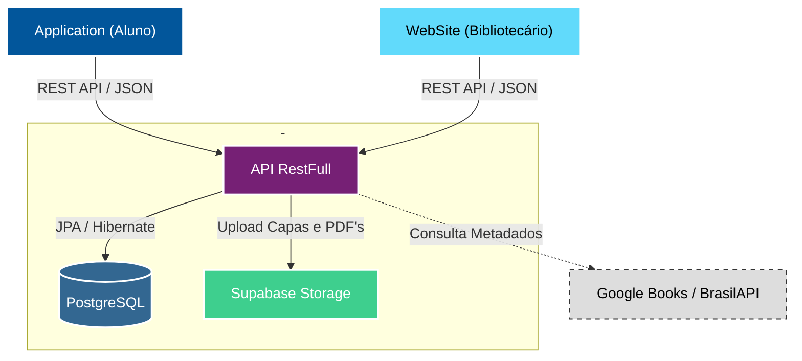

<div align="center">
  <!-- Banner -->
  <a href="https://n33miaz.github.io/n33miaz-links/#lumitcc"></a>

  <!-- Pins-->
  <a href="https://n33miaz.github.io/n33miaz-links/#lumiweb"></a>
  <a href="https://n33miaz.github.io/n33miaz-links/#lumiapp"></a>
  <a href="https://n33miaz.github.io/n33miaz-links/#lumiapi"></a>
</div>

<br/>

<div align="center">


</div>

<br/>

<div align="center">
  <h1>Sobre o Projeto</h1>
</div>

O **LumiLivre APP** é a ponta do ecossistema voltada para os **alunos**. Desenvolvido em **Flutter**, o aplicativo funciona como uma vitrine digital, permitindo que os estudantes explorem o acervo da biblioteca, verifiquem a disponibilidade de livros e realizem solicitações de empréstimo de forma autônoma.

Diferente de sistemas tradicionais, o app foca na experiência do usuário (UX), oferecendo recursos como **Gamificação (Ranking de Leitura)**, **Modo Offline** para consulta de catálogo e **Autenticação Biométrica**.

<br/>

<div align="center">
  <h1>Screenshots</h1>
</div>

<div align="center">
  
  
</div>

<br/>

<div align="center">
  <h1>Stack Técnica</h1>
</div>

| Camada | Tecnologia |
|--------|------------|
| Linguagem / SDK | Dart 3.9 + Flutter |
| Estado | Provider 6.1 (`ChangeNotifier`) |
| HTTP | `http` 1.5 (+ `dio` para clients gerados) |
| Persistência segura | **flutter_secure_storage** (token + user) |
| Persistência leve | `shared_preferences` (tema, favoritos) |
| UI | Material 3, `flutter_svg`, `cached_network_image`, Lottie |
| Segurança local | `local_auth` |
| Upload | `image_picker`, `http_parser` |
| Conectividade | `connectivity_plus`, `internet_connection_checker` |
| Contratos | **openapi-generator-cli** (scripts/generate_api) |
| Testes | `flutter_test`, `flutter_lints` |
| Build por ambiente | **Flavors Android (dev/staging/prod)** + `--dart-define=API_BASE_URL` |

<br/>

<div align="center">
  <h1>Funcionalidades Principais</h1>
</div>

### 📚 Catálogo & Busca
- **Vitrine Virtual:** carrosséis por categoria com **infinite scroll**.
- **Busca Inteligente:** por título, autor ou ISBN.
- **Detalhes do Livro:** sinopse, classificação, disponibilidade em tempo real (estoque físico).
- **Modo Offline:** cache local via `SharedPreferences` (`catalog_cache_v1`) com stale-while-revalidate.

### 🔄 Empréstimos & Solicitações
- **Solicitação Digital:** aluno solicita pelo app, bibliotecário aprova no web.
- **Status em Tempo Real** (PENDENTE/ACEITA/REJEITADA).
- **Histórico** de empréstimos e solicitações.

### 👤 Perfil & Gamificação
- **Ranking** de leitores com filtros por curso/módulo/turno.
- **Foto de perfil** com upload para Supabase.
- **Favoritos** locais por ID.

### ⚙️ Recursos Técnicos Avançados
- **Secure Storage:** token JWT em `flutter_secure_storage` (Keystore/Keychain).
- **Restore de sessão** no boot (`tryAutoLogin` em `main.dart` + splash durante validação).
- **Biometria:** suporte via `local_auth`.
- **Temas:** claro / escuro / sistema.
- **ApiService** dividido em facade (`AuthApi`, `BookApi`, `CatalogApi`, `LoanApi`, `RankingApi`, `StudentApi`, `UploadApi`) — cada domínio abaixo de 200 linhas.

### Ambientes

O app usa **flavors Android** e `--dart-define=API_BASE_URL` para selecionar a API:

```bash
flutter run --flavor dev     --dart-define=API_BASE_URL=http://127.0.0.1:8080
flutter run --flavor staging --dart-define=API_BASE_URL=https://staging.lumilivre.example
flutter run --flavor prod
```

Sem `API_BASE_URL`, o app usa `https://lumilivre-api.onrender.com`.

<br/>

<div align="center">
  <h1>Arquitetura do Sistema</h1>
</div>

Utilizamos uma arquitetura cliente-servidor moderna baseada em microsserviços e nuvem para garantir escalabilidade.



### Estrutura interna

```
lib/
  main.dart                 (bootstrap + tryAutoLogin + splash)
  providers/                (AuthProvider, ThemeProvider, FavoritesProvider)
  services/                 (ApiService facade + AuthApi/BookApi/CatalogApi/LoanApi/RankingApi/StudentApi/UploadApi)
  services/auth_storage.dart (flutter_secure_storage)
  api/gen/                  (clients gerados pelo openapi-generator-cli)
  models/ · screens/ · widgets/ · utils/
assets/ (images, icons, animations)
android/ · ios/ · web/
test/    (providers, services, models, utils, bootstrap)
scripts/ (generate_api.sh | .bat)
```

<br/>

<div align="center">
  <h1>Segurança</h1>
</div>

- **Autenticação JWT** em todas as requisições sensíveis.
- **Secure Storage** (Keystore/Keychain) para token e dados de usuário.
- **Validação de Senha Inicial** no primeiro acesso (bloqueia navegação principal até a troca).
- **Convidado** navega sem token, mas não consegue solicitar empréstimo nem acessar dados pessoais.

<br/>

<div align="center">
  <h1>Como rodar localmente</h1>
</div>

```powershell
# 1. Dependências
flutter pub get

# 2. Gerar clients OpenAPI (opcional; requer API com /v3/api-docs)
.\scripts\generate_api.bat

# 3. Executar
flutter run --flavor dev --dart-define=API_BASE_URL=http://10.0.2.2:8080

# 4. Testes
flutter analyze
flutter test

# 5. Build de produção
flutter build apk --flavor prod --dart-define=API_BASE_URL=https://api.lumilivre.com.br
flutter build ios --flavor prod --dart-define=API_BASE_URL=https://api.lumilivre.com.br
```

<br/>

<div align="center">
  <h1>Licença</h1>
</div>

Distribuído sob a licença **MIT**. Veja `LICENSE` para mais detalhes.

<br/>

<div align="center">
  <sub>LumiLivre © 2026 - Todos os direitos reservados.</sub>
</div>
