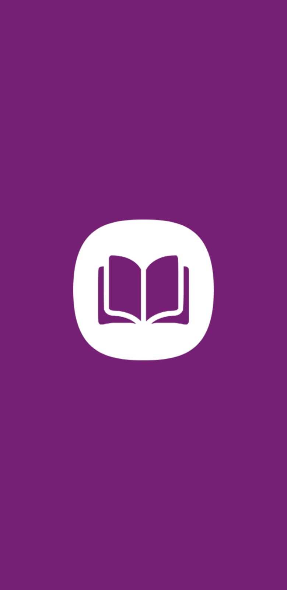
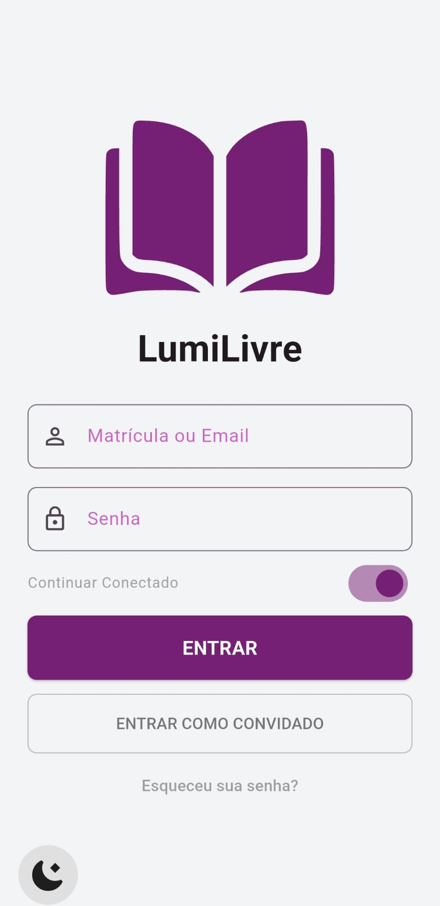
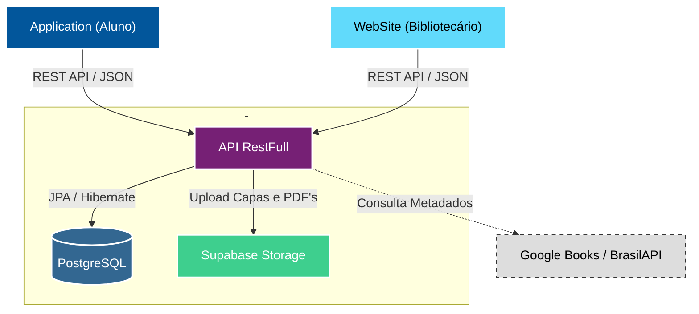

  <!-- Banner -->
  

  <!-- Pins dos Repositórios -->
  &nbsp;&nbsp;&nbsp;
  &nbsp;&nbsp;&nbsp;
  

 

  <h1>Sobre o Projeto</h1>

O **LumiLivre APP** é a ponta do ecossistema voltada para os **alunos**. Desenvolvido em **Flutter**, o aplicativo funciona como uma vitrine digital, permitindo que os estudantes explorem o acervo da biblioteca, verifiquem a disponibilidade de livros e realizem solicitações de empréstimo de forma autônoma.

Diferente de sistemas tradicionais, o app foca na experiência do usuário (UX), oferecendo recursos como **Gamificação (Ranking de Leitura)**, **Modo Offline** para consulta de catálogo e **Autenticação Biométrica**.

 

  <h1>Screenshots</h1>

  
  

 

  <h1>Funcionalidades Principais</h1>

### 📚 Catálogo & Busca
- **Vitrine Virtual:** Carrosséis de livros organizados por categorias (Aventura, Romance, TCCs, etc.).
- **Busca Inteligente:** Pesquisa por título, autor ou ISBN.
- **Detalhes do Livro:** Sinopse, classificação etária, número de páginas e **disponibilidade em tempo real** (integração com estoque físico).

### 🔄 Empréstimos & Solicitações
- **Solicitação Digital:** O aluno solicita um livro pelo app e aguarda a aprovação do bibliotecário.
- **Status em Tempo Real:** Acompanhamento de solicitações (Pendente, Aprovado, Recusado).
- **Histórico:** Visualização de todos os empréstimos já realizados e devolvidos.

### 👤 Perfil & Gamificação
- **Ranking de Leitores:** Sistema de gamificação que exibe os alunos que mais leem na instituição.
- **Carteirinha Virtual:** Dados do aluno e foto de perfil integrados.
- **Favoritos:** Lista de desejos para leituras futuras.

### ⚙️ Recursos Técnicos Avançados
- **Modo Offline (Cache):** O catálogo é salvo localmente (`SharedPreferences`), permitindo consulta mesmo sem internet.
- **Biometria:** Login rápido utilizando impressão digital ou reconhecimento facial (`local_auth`).
- **Temas:** Suporte completo a **Modo Claro** e **Modo Escuro**.

 

  <h1>Arquitetura do Sistema</h1>

Utilizamos uma arquitetura cliente-servidor moderna baseada em microsserviços e nuvem para garantir escalabilidade.

 

  <h1>Segurança</h1>

- **Autenticação JWT:** Todas as requisições sensíveis utilizam tokens JWT validados pelo backend.
- **Secure Storage:** O token é armazenado de forma segura no dispositivo.
- **Validação de Senha Inicial:** O app força a troca de senha no primeiro acesso para garantir a segurança da conta do aluno.

 

  LumiLivre © 2025 - Todos os direitos reservados.

