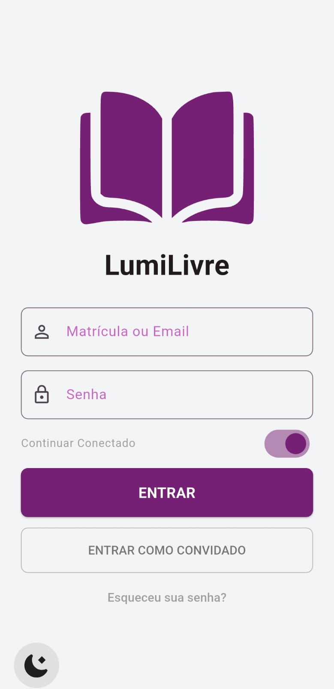
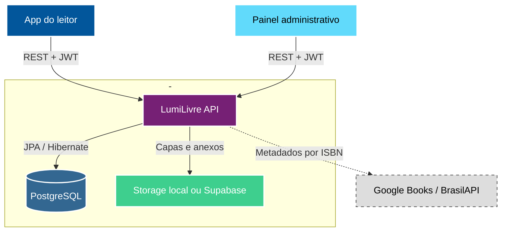

<div align="center">
  <!-- Banner -->
  <a href="https://n33miaz.github.io/n33miaz-links/#lumitcc"></a>

  <!-- Pins-->
  <a href="https://github.com/n33miaz/lumilivre-web"></a>
  <a href="https://github.com/n33miaz/lumilivre-app"></a>
  <a href="https://github.com/n33miaz/lumilivre-api"></a>
</div>

<br/>

<div align="center">


</div>

<br/>

<div align="center">
  <h1>LumiLivre App</h1>
  <p><em>App do leitor — catálogo, empréstimos e mural da biblioteca escolar.</em></p>
</div>

O **LumiLivre App** é a ponta do ecossistema voltada para os leitores. Feito em
Flutter, funciona como vitrine digital da biblioteca: o aluno explora o acervo,
confere disponibilidade real de exemplares, solicita empréstimo sem passar pelo
balcão, acompanha o próprio histórico e lê os avisos publicados pela biblioteca.

Além do básico, traz ranking de leitura para incentivar o hábito, catálogo
disponível offline e um mural segmentado por curso, módulo ou turno.

<br/>

<div align="center">
  <h1>Screenshots</h1>
</div>

<div align="center">
  
  
</div>

## Stack

| Camada | Tecnologia |
|--------|------------|
| Linguagem / SDK | Dart 3.10 · Flutter 3.35+ |
| Estado | Provider 6.1 (`ChangeNotifier`) |
| HTTP | `http` 1.5 |
| Token e sessão | `flutter_secure_storage` (Keystore no Android, Keychain no iOS) |
| Preferências | `shared_preferences` (tema, idioma, favoritos, cache) |
| UI | Material 3, `flutter_svg`, `cached_network_image` |
| Upload | `image_picker`, `http_parser` |
| Conectividade | `connectivity_plus` |
| Versão do app | `package_info_plus` |
| Localização | `flutter_localizations` + ARB (`gen-l10n`) |
| Testes | `flutter_test`, `flutter_lints` |
| Ambientes | flavors Android (dev/staging/prod) + `--dart-define=API_BASE_URL` |

## Rodando local

```powershell
flutter pub get
flutter run --flavor dev --dart-define=API_BASE_URL=http://10.0.2.2:8080
```

`10.0.2.2` é como o emulador Android alcança o `localhost` da máquina. Em
dispositivo físico use o IP da sua rede. Para subir a API junto, o
`docker-compose.yml` do repositório de orquestração
[`lumilivre`](https://github.com/n33miaz/lumilivre) levanta tudo em um comando.

Credenciais de demonstração do stack local: matrícula `2024001`, senha `2024001`
(o app pedirá a troca de senha no primeiro acesso — é o fluxo sendo demonstrado).

### Comandos

```powershell
flutter pub get
flutter analyze
dart format --set-exit-if-changed .
flutter test
flutter test --coverage
```

## Ambientes e build

O único define lido pelo código é `API_BASE_URL` (`lib/utils/constants.dart`).
Sem ele o app aponta para `https://lumilivre-api.onrender.com`.

```powershell
flutter run --flavor dev     --dart-define=API_BASE_URL=http://10.0.2.2:8080
flutter run --flavor staging --dart-define=API_BASE_URL=https://staging.exemplo.com
flutter run --flavor prod    --dart-define=API_BASE_URL=https://api.exemplo.com
```

Os flavors só existem no Android (`dev` e `staging` recebem sufixo no
`applicationId` e permitem tráfego em claro; `prod` não). O projeto iOS tem um
único scheme, então `flutter build ios --flavor` não se aplica.

### Release Android

O build de release precisa de `android/key.properties` apontando para o seu
keystore:

```properties
storeFile=lumilivre-release-key.jks
storePassword=<senha>
keyAlias=<alias>
keyPassword=<senha>
```

O arquivo e o `.jks` são ignorados pelo git e **nunca** devem ser versionados.
Sem eles o build cai para a assinatura de debug, então ele conclui, mas o
artefato não serve para publicação.

```powershell
flutter build apk       --release --flavor prod --dart-define=API_BASE_URL=https://api.exemplo.com
flutter build appbundle --release --flavor prod --dart-define=API_BASE_URL=https://api.exemplo.com
```

| Item | Valor |
|------|-------|
| `applicationId` | `br.com.lumilivre.lumilivre` (`.dev` / `.staging` por flavor) |
| Versão | `1.1.0+2` (vem do `pubspec.yaml`) |
| `compileSdk` / `minSdk` | 36 / 24 |
| Permissões | `INTERNET`, `USE_BIOMETRIC` |

## Funcionalidades

**Catálogo** — carrosséis por categoria com scroll infinito, busca por título,
autor ou ISBN, e detalhe do livro com sinopse, classificação e disponibilidade
real de exemplares.

**Modo offline** — o catálogo e o mural ficam em cache local
(`shared_preferences`) com estratégia stale-while-revalidate; um banner avisa
quando os dados exibidos vêm do cache.

**Empréstimos** — solicitação pelo app com aprovação do bibliotecário no painel
web, acompanhamento de status (pendente, aceita, rejeitada, cancelada) e
histórico completo.

**Mural** — avisos, anexos e trabalhos acadêmicos publicados pela biblioteca,
filtrados pelo público do leitor (todos, curso, módulo ou turno). Links abrem
apenas em `http`/`https`.

**Perfil e ranking** — ranking de leitores com filtro por curso, módulo e turno;
foto de perfil enviada para a API (quando a biblioteca permite); favoritos
locais.

**Onboarding** — troca obrigatória de senha no primeiro acesso, seguida de um
tour guiado pelas abas.

**Controle de versão** — antes do login o app consulta `GET /api/app-version`; se
a versão instalada não é mais suportada, uma tela bloqueia o uso e direciona
para a loja. Falha de rede não bloqueia (fail-open).

## Arquitetura


```mermaid
flowchart TD
    classDef mobile fill:#02569B,stroke:#fff,stroke-width:2px,color:#fff;
    classDef web fill:#61DAFB,stroke:#fff,stroke-width:2px,color:#000;
    classDef api fill:#762075,stroke:#fff,stroke-width:2px,color:#fff;
    classDef db fill:#336791,stroke:#fff,stroke-width:2px,color:#fff;
    classDef storage fill:#3ECF8E,stroke:#fff,stroke-width:2px,color:#fff;
    classDef external fill:#ddd,stroke:#333,stroke-width:1px,color:#000,stroke-dasharray: 5 5;

    UserMobile["App do leitor"]:::mobile
    UserWeb["Painel administrativo"]:::web

    subgraph Cloud["-"]
        direction TB
        API["LumiLivre API"]:::api
        DB[("PostgreSQL")]:::db
        Storage["Storage local ou Supabase"]:::storage
    end

    External["Google Books / BrasilAPI"]:::external

    UserMobile -->|REST + JWT| API
    UserWeb -->|REST + JWT| API

    API -->|JPA / Hibernate| DB
    API -->|Capas e anexos| Storage
    API -.->|Metadados por ISBN| External
```

### Estrutura

```
lib/
  main.dart                  (bootstrap, gate de versão, auto-login, splash)
  l10n/                      (app_pt.arb, app_en.arb + gerados)
  providers/                 (auth, theme, favorites, locale, settings,
                              content, app_update)
  services/
    api.dart                 (facade)
    auth_api · book_api · catalog_api · loan_api · reader_api ·
    ranking_api · upload_api · app_version_api · content_api · settings_api
    auth_storage.dart        (flutter_secure_storage)
    loan_status_calculator.dart
  models/ · screens/ · widgets/ · utils/
assets/ (images, icons, animations)
android/ · ios/ · web/
test/ (models, providers, services, screens, utils, helpers, bootstrap)
```

A regra de status de empréstimo mora em `LoanStatusCalculator`, fora da camada de
UI, o que a torna testável isoladamente.

## Idiomas

Português e inglês, com 59 mensagens cada em `lib/l10n/app_pt.arb` e
`app_en.arb`. Os arquivos gerados por `gen-l10n` são versionados e `generate:
true` no `pubspec.yaml` os regenera a cada `flutter pub get`. O idioma segue o
sistema e pode ser trocado no app.

> As telas mais antigas (login, catálogo, detalhes do livro e diálogos de senha)
> ainda têm textos fixos em português — a migração para `AppLocalizations` está em
> andamento.

## Testes

```powershell
flutter test
```

A suíte cobre models, providers, serviços, cálculo de status de empréstimo,
widgets de tela e o bootstrap completo do app (auto-login mais gate de versão).
Os testes usam mocks de `SharedPreferences`, `FlutterSecureStorage` e
`PackageInfo`, então não tocam rede nem disco real.

## Licença

**Proprietário — todos os direitos reservados.** Veja [`LICENSE`](LICENSE). O
código é publicado para leitura, estudo e avaliação técnica; qualquer uso, cópia
ou execução em produção requer licença comercial — **ncormino@gmail.com**.

<br/>

<div align="center">
  <sub>LumiLivre © 2026 — Gestão de bibliotecas escolares · Todos os direitos reservados.</sub>
</div>
