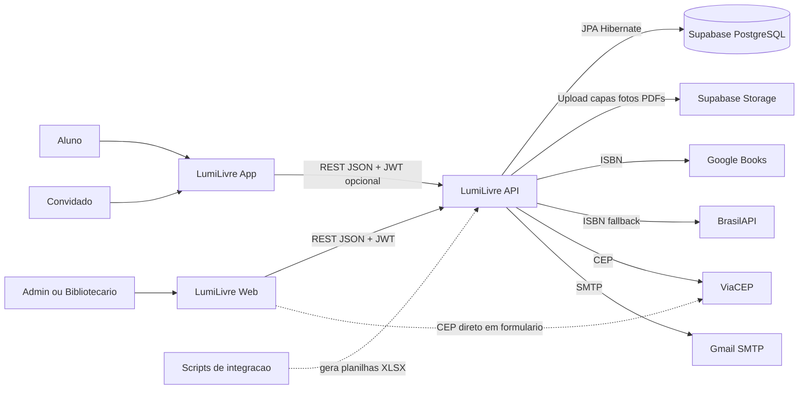
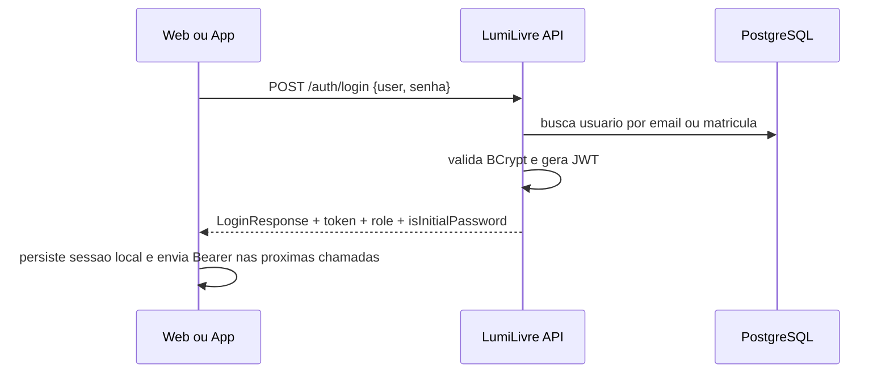
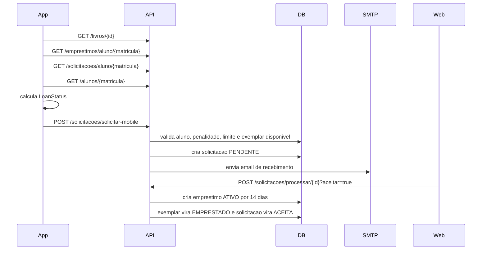
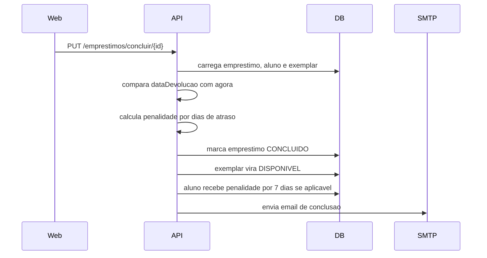
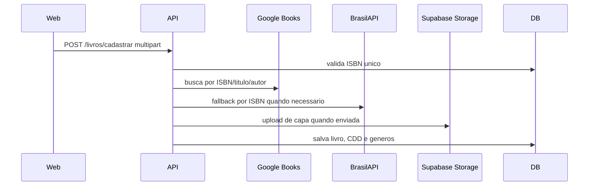

# LumiLivre - Contexto Global

## Visao Geral

LumiLivre e um ecossistema de gestao de biblioteca formado por tres projetos principais:

- `lumilivre-api`: backend Spring Boot, fonte de verdade das regras de negocio, persistencia, autenticacao e integracoes.
- `lumilivre-web`: painel administrativo React para bibliotecarios e administradores.
- `lumilivre-app`: aplicativo Flutter para alunos e convidados.

A API e o centro arquitetural. Web e mobile se comunicam com ela por REST/JSON usando JWT. A API persiste dados em PostgreSQL, armazena arquivos no Supabase Storage e consulta servicos externos para ISBN, CEP e emails.

A pasta `integracao` na raiz contem scripts e planilhas auxiliares de preparacao/validacao de dados, principalmente para cruzamento de livros e exemplares antes de importacao.

## Diagrama Logico

## Padrao Arquitetural do Ecossistema

- Backend: monolito modular em camadas, no estilo MVC + Service Layer + Repository.
- Web: SPA feature-oriented, com services HTTP, hooks de query/mutation, contexts e componentes reutilizaveis.
- Mobile: Flutter com Provider/ChangeNotifier, service singleton e telas orientadas a fluxo.
- Comunicacao: REST/JSON; uploads usam multipart/form-data; relatorios usam PDF em blob/stream.
- Autenticacao: JWT Bearer emitido pela API e persistido pelos clientes.
- Estado remoto: TanStack Query no web; chamadas diretas e cache local no mobile.
- Persistencia local: `localStorage` no web; `SharedPreferences` no mobile.

Patterns observados:

- Repository Pattern nos repositories JPA.
- Service Layer para casos de uso do backend.
- DTO Pattern para contratos de API.
- Facade/Adapter para integracoes externas (`GoogleBooksService`, `BrasilApiService`, `SupabaseStorageService`, `ApiService`).
- Singleton no `ApiService` mobile.
- Observer via `ChangeNotifier` no Flutter.
- Provider/Context para estado transversal no React e Flutter.

## Regras de Negocio Identificadas

### Autenticacao e Usuarios

- Login aceita email ou matricula no campo `user`.
- Senhas sao armazenadas com BCrypt.
- JWT contem roles e expira conforme configuracao da API.
- Roles de dominio: `ADMIN`, `BIBLIOTECARIO`, `ALUNO`.
- Aluno tem senha inicial igual a matricula.
- Admin/bibliotecario podem ser marcados como senha inicial quando a senha equivale ao email.
- Recuperacao de senha usa token UUID com validade de 30 minutos.
- Alteracao de senha exige senha atual.
- Aluno so pode alterar a propria senha quando a role e `ALUNO`.

### Alunos

- Matricula e unica.
- CPF e unico quando informado.
- Email deve ser unico na tabela de usuarios.
- Curso, turno e modulo devem existir para cadastrar/atualizar aluno.
- Cadastro de aluno com email cria usuario vinculado com role `ALUNO`.
- Reset administrativo de senha de aluno volta a senha para a matricula.
- CEP com 8 digitos pode enriquecer endereco via ViaCEP.
- Aluno possui `emprestimosCount`, usado no ranking.
- Aluno pode ter penalidade e data de expiracao de penalidade.

### Livros e Catalogo

- ISBN e unico quando informado.
- Cadastro/atualizacao tenta enriquecer dados por Google Books e BrasilAPI.
- Titulo, editora e autor sao obrigatorios.
- Data de lancamento nao pode ser futura.
- CDD informado deve existir.
- Generos vinculados ao livro sao limitados a 3 encontrados.
- Avaliacao padrao e 4.6.
- Catalogo mobile agrupa livros por genero e retorna ate 10 por genero, priorizando lancamento mais recente e ID mais novo.
- Detalhe do livro calcula total de exemplares e exemplares disponiveis.

### Exemplares

- Exemplar e identificado por tombo unico.
- Todo exemplar deve estar associado a um livro.
- Status de exemplar: `DISPONIVEL`, `INDISPONIVEL`, `EM_MANUTENCAO`, `EMPRESTADO`.
- Exemplar so pode ser emprestado quando esta `DISPONIVEL`.
- Ao emprestar, exemplar vira `EMPRESTADO`.
- Ao concluir ou excluir emprestimo ativo/atrasado, exemplar volta para `DISPONIVEL`.
- Exemplar com emprestimo ativo ou atrasado nao pode ser excluido.
- Quantidade do livro deve refletir a contagem de exemplares.

### Emprestimos

- Data de emprestimo e data de devolucao sao obrigatorias.
- Data de devolucao nao pode ser anterior a data de emprestimo.
- Limite principal: 3 emprestimos ativos por aluno.
- No fluxo de solicitacao, o limite considera `ATIVO` + `ATRASADO`.
- Aluno com penalidade ativa nao pode emprestar nem solicitar.
- Penalidade expirada pode ser removida no fluxo de novo emprestimo.
- Status de emprestimo: `ATIVO`, `CONCLUIDO`, `ATRASADO`.
- Atraso tambem e inferido por `dataDevolucao < hoje` em consultas, mesmo quando o status persistido ainda esta `ATIVO`.
- Ao cadastrar emprestimo, contador de emprestimos do aluno aumenta.
- Ao excluir emprestimo, contador diminui quando existe aluno vinculado.
- Emprestimo concluido nao pode ser alterado nem concluido novamente.
- Conclusao atrasada calcula penalidade por dias de atraso.
- Penalidade aplicada ao aluno dura 7 dias quando for mais grave que a atual.

### Penalidades

- Ate 1 dia de atraso: `REGISTRO`.
- De 2 a 5 dias: `ADVERTENCIA`.
- De 6 a 7 dias: `SUSPENSAO`.
- De 8 a 90 dias: `BLOQUEIO`.
- Acima de 90 dias: `BANIMENTO`.
- Penalidade mais grave substitui penalidade menos grave.

### Solicitacoes

- Solicitacao nasce como `PENDENTE`.
- Status possiveis: `PENDENTE`, `ACEITA`, `REJEITADA`, `CANCELADA`.
- Solicitar por tombo exige exemplar especifico disponivel.
- Solicitar pelo app mobile usa ID do livro e seleciona o primeiro exemplar disponivel.
- Solicitacao mobile recebe observacao `Solicitado via Mobile`.
- Aceitar solicitacao cria emprestimo automaticamente com prazo de 14 dias.
- Rejeitar solicitacao apenas muda status para `REJEITADA`.
- Email e enviado em recebimento, aceite e rejeicao quando possivel.

### TCCs

- Titulo, alunos e curso sao obrigatorios.
- Curso informado deve existir.
- PDF deve ser `application/pdf`.
- Foto e PDF sao enviados para storage.
- TCC possui flag `ativo`.

### Relatorios e Importacao

- Relatorios administrativos sao gerados em PDF.
- Importacao aceita apenas `.xlsx`.
- Tipos aceitos: aluno, livro e exemplar.
- Importacao trabalha em lotes de 50.
- Planilhas validam duplicidades internas e duplicidades ja existentes.
- Alunos importados geram usuarios com senha padrao igual a matricula.
- Livros importados exigem CDD valido.
- Exemplares importados atualizam a quantidade do livro.

### Clientes

- Web protege rotas administrativas no frontend via `ProtectedRoute`.
- Web faz logout automatico em 401/403 e em erro de rede com usuario autenticado.
- Web valida formularios com Zod antes de enviar.
- Mobile permite modo convidado para navegacao parcial.
- Mobile usa cache local do catalogo e exibe banner offline.
- Mobile calcula localmente o estado do botao de emprestimo com prioridade definida.
- Mobile bloqueia visualmente solicitacao para convidado, penalidade, limite, pendencia, emprestimo ativo e indisponibilidade.

## Fluxos de Dados Transversais

### Login

### Solicitacao Mobile ate Emprestimo

### Devolucao com Penalidade

### Cadastro de Livro com Metadados

## Padroes Comuns e Diretrizes de Evolucao

- Manter a API como fonte de verdade para regras de negocio; clientes podem validar UX, mas nao substituir validacao backend.
- Manter contratos REST versionados/documentados por OpenAPI.
- Padronizar DTOs para todas as respostas publicas.
- Evitar logica duplicada entre web e app; regras puras de cliente devem refletir claramente as regras da API.
- Externalizar segredos e configuracoes por ambiente.
- Evoluir cache de memoria para cache distribuido se houver mais de uma instancia da API.
- Considerar eventos/filas para email, evitando que notificacoes fiquem acopladas ao tempo de resposta da transacao.
- Considerar jobs agendados para marcar emprestimos atrasados de forma persistida.
- Gerar cliente TypeScript/Dart a partir do OpenAPI para reduzir divergencia de contratos.
